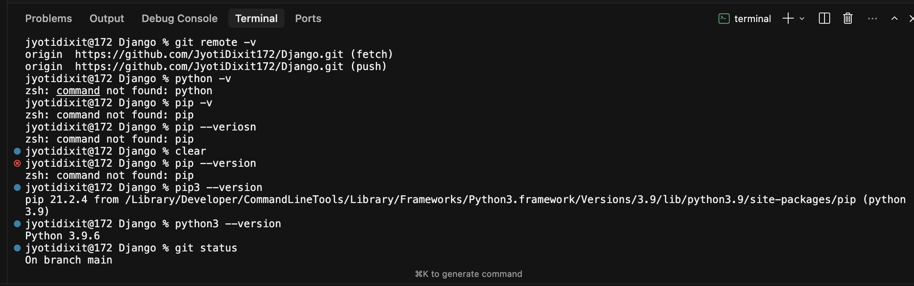
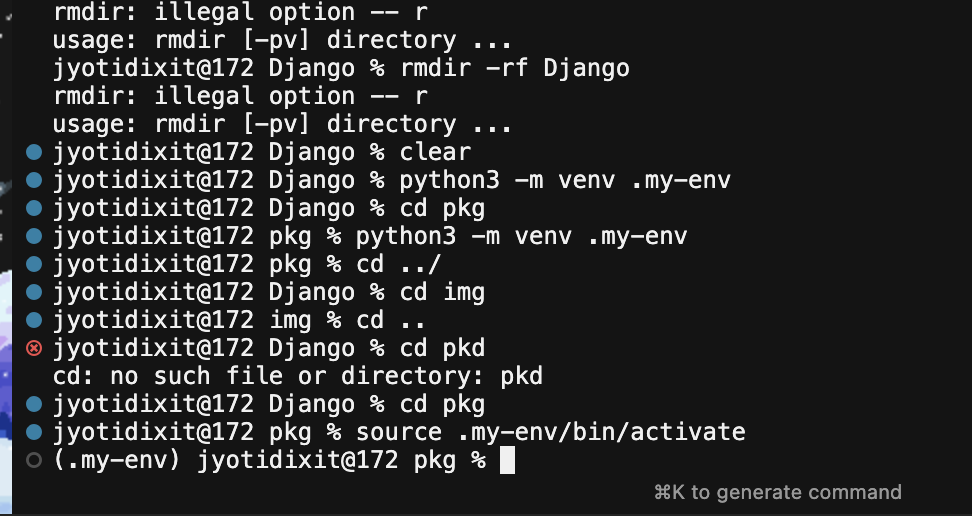
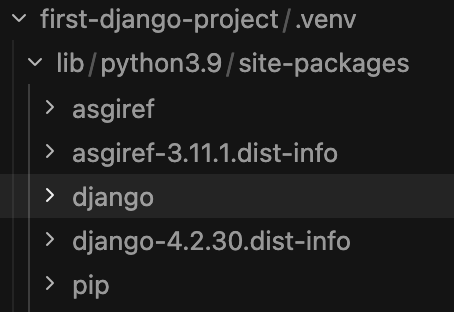
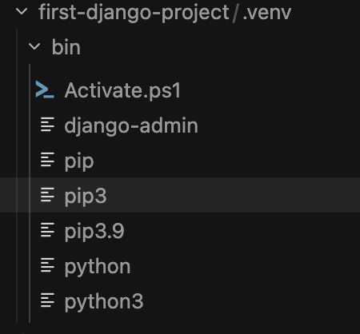
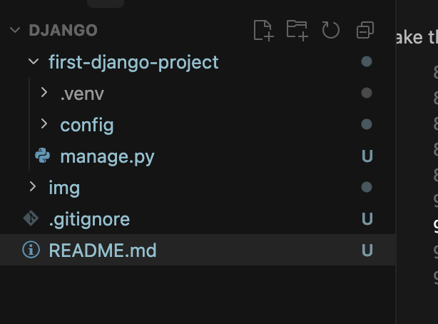
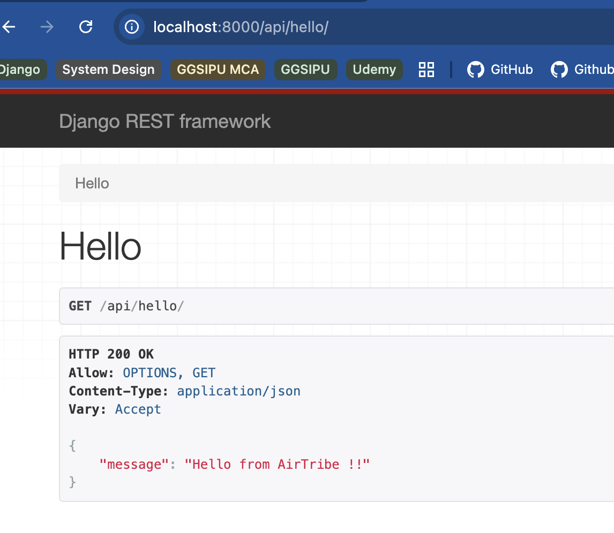

# Django

Django Notes - Practice, project

-> check pip3 & python3 version: pip3 --version | python3 --version

-> refer to image: 

-> Django is not available with the python package; whatever dependencies you get from outside of available ones is called package.

-> pip: used to manage the Packages (package manager) in python Project.

-> usually pip used as many times when we need something from outside.

-> there are many python projects where pip is not used, an alternative to pip is used -> like POETRY, UV (not part of curriculum)

-> but while going forward we will be learning uv -> as uv is far better than pip. (Instructor personally believed while creating his personal projects)

-> Similar to node.js, whenever we have conflicting dependencies wrt different project, like x dependency si working with 1 while not with 2, but y package works with 2 and not with x.

-> to solve this problem: whenever we build a project -> we keep the copies of whatever package we download in the same folder - LOCAL COPY

-> we don't store it in a way where the packages can be accessed by every project - GLOBAL COPY

-> In case if local copies you can maintain different versions also.

Java -> global copy is always maintained
Javascript -> a local copy is always maintained
Python -> both copies are maintained

-> RECOMMENDED: as a BACKEND ENGINEER -> maintain local copies -> unless it's ABSOLUTELY necessary for you to maintain a GLOBAL COPY

-> venv in python -> a copy of python dependencies inside the particular project -> a version of Python inside the current project.

-> currently pkg -> has a venv -> VIRTUAL

-> can also seggregate versions in an virtual environment

-> at time of creating virtual environments: you can add to have x specific version, but it needs to be on your machine first (globally)

-> once a virtual env is created -> can't be changed 
-> you eed delete that one, create again for to have anothr dependencies.

-> the ability to have virtual environment allows python to maintain both Global & local copies of dependencies for project(s).

-> once venv is created, you need to enable it for use. (it doesn't get enabled automaticaly) 

-> refer to image: 

-> need to have .my-env in the .gitignore as it's a virtual environment , DON'T PUSH it to GITHUB. 

-> as venv is a local copy of Python and Package for this specific Machine, it's large machine specific and can be recreated.

-> for the 1st Django project you need to install django admin. -> which can be used to create a Django project

download an external package called django-admin for my dango project.

-> django: framework written in python for creating backend applications

-> very vast package which you will be downloading on your machine for creating  a backend application
 
-> UNDERSTAND FRAMEWORK VS LIBRARY

-> before downloading django: make sure that venv is activated -> .venv/bin/django-admin, lib/django, lib.django-4.2.30-dist-info

-> so django got locally installed in this folder cause of virtual environment.

-> refer to image: 

-> to get multiple packages in an virtual environment
-> also install django-rest framework: pip install django djangorestframework

# DJANGO HAS TWO CONCEPTS: creating project & creating an App

-> Master-slave: one project -> multiple apps
              (master)       (slave)
that's the protocol Djago wants the developer to work; but it is not bounded that you have wokr in that manner, but django's rule tells developer to do it that way.

IT CAN HAVE MULTIPLE APPS, IT SHOULD HAVE MULTIPLE APPS, but AGAIN it's not MANDATORY.

first-django-project (master):project -> n app(s) (slaves)

# first make the first-django-project : as django project.

-> as we have used pip install django to install django: we can use comamnd called as **django admin**

-> run : django-admin startproject config . -> in the current folder where you want to make it a project

#### a config folder was created with manage.py file in project (first-django-project): 

-> for marking django project, refer to this image: 

-> manage.py: IMP file in terms of a django project. (Understand WHY separately) : auto-generated file
-> config/: all .py files in this folder is also important (Will be discussed later)

## Create a small DJANGO app inside this DJANGO project

-> inside the current venv, run the following comamnd:

python manage.py startapp <name-of-the-app>

-> api has it's own folder & migrations (let's discuss it later)

## Open config/setting.py

1. settings.py: MOST IMPORTANT files for your django project -> contains configurations related to your Django project

2. configuration in setting.py -> refers to some data which is Very IMPORTANT for your Django application to run.
- Ex: connect to a DB -> need to provide the configurations (credentials) of this DB in this settings.py file.
- Many more config as we keep going on with this project.

3. configurations refer to some imp data which is required to run your application.

settings.py -> django = .env -> node.js

4. if you want specific config's specific to an app -> that's also possible

# Add frameworks in config/settings.py -> INSTALLED_APPS variables

-> like this: 
INSTALLED_APPS = [
    'django.contrib.admin',
    'django.contrib.auth',
    'django.contrib.contenttypes',
    'django.contrib.sessions',
    'django.contrib.messages',
    'django.contrib.staticfiles',
    # extra library added - rest_framework: discussed later
    'rest_framework',
    # name of the app which I've created
    'api',
]

# Create a Simple Application

1. first-django-project/api/views.py: inside this write the code.

2. running the django app - 1st time 

3. now add two numbers and run the django app

